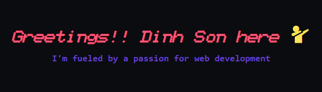

***

**About me**
- 💼 I study **_Computer Science_** at [**_Ho Chi Minh University of Information Technology_**](https://www.uit.edu.vn) **(VNUHCM-UIT)**

- 📈 All of my projects are available at [here](https://github.com/DinhSonpro12).

- ❤️ I love designing and developing websites. 

- 📝 I have a lot experience in creating web app by ReactJS & NodeJS with MongoDB.

- 🌱 I’m currently learning TypeScript & GraphQL.

  <code></code>
<code>  </code>
<code>  </code>
<code></code>
<code>  </code>
<code></code>
<code>  </code>

***

#### Some of my Repositories

<!--
**DinhSonpro12/DinhSonpro12** is a ✨ _special_ ✨ repository because its `README.md` (this file) appears on your GitHub profile.

Here are some ideas to get you started:

- 🔭 I’m currently working on ...
- 🌱 I’m currently learning ...
- 👯 I’m looking to collaborate on ...
- 🤔 I’m looking for help with ...
- 💬 Ask me about ...
- 📫 How to reach me: ...
- 😄 Pronouns: ...
- ⚡ Fun fact: ...
-->
